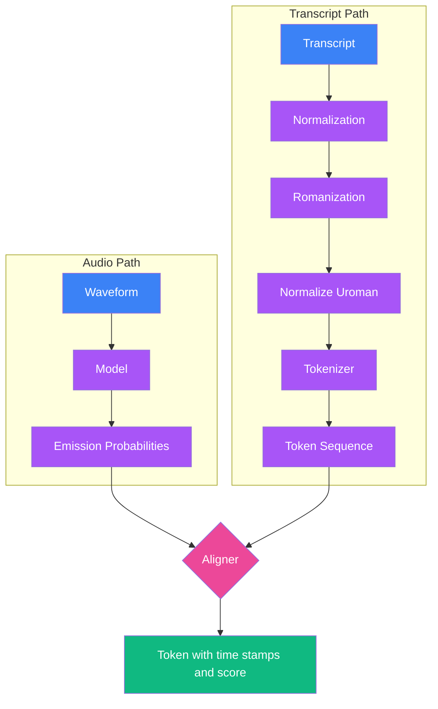

# Fine Tuning Whisper
This project is dedicated to fine-tuning OpenAI’s Whisper model to significantly improve its performance on Khmer (Cambodian) speech recognition tasks. It includes custom scripts, curated datasets, and an end-to-end training pipeline specifically designed for enhancing Whisper’s transcription accuracy on Khmer audio. The goal is to make Whisper more robust and reliable for real-world transcription scenarios and voice-driven applications in the Khmer language.

### Forced Alignment
Forced alignment plays a critical role in preparing training data by synchronizing audio recordings with their corresponding text transcriptions. This process divides each audio file into segments that precisely match the spoken words or phrases in the transcript. Proper alignment ensures the model can learn accurate temporal relationships between sound and text, which is essential for improving both training efficiency and final transcription quality.

- [Forced alignment for multilingual data](https://docs.pytorch.org/audio/main/tutorials/forced_alignment_for_multilingual_data_tutorial.html)
- [CTC forced alignment API tutorial](https://docs.pytorch.org/audio/main/tutorials/ctc_forced_alignment_api_tutorial.html)
